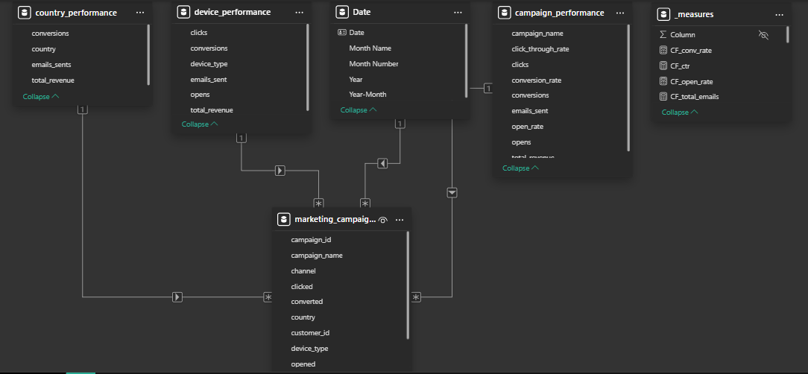
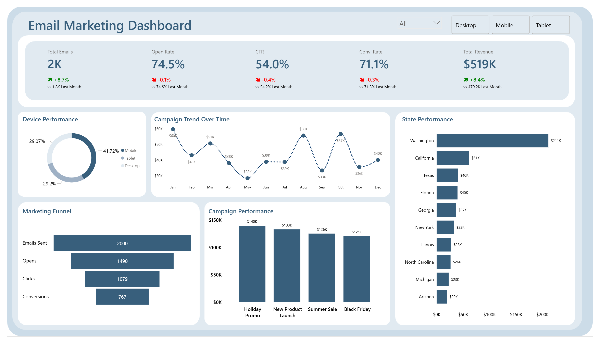
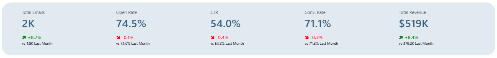
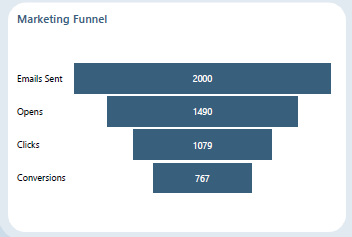
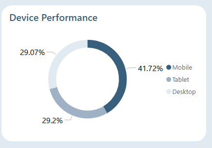
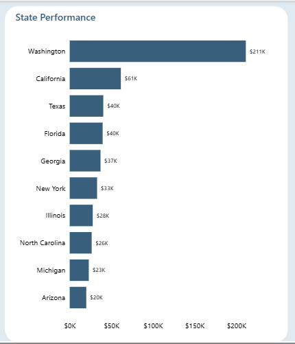
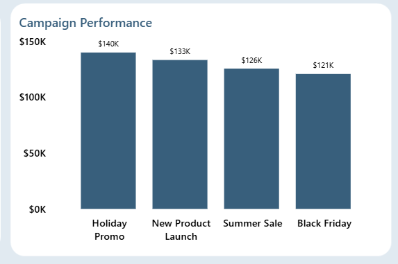

# Email Marketing Campaign Performance Analysis (Excel + SQL + Power BI)
---
## Background and Overview  

Email marketing remains one of the most cost-effective digital marketing channels, but its success depends on optimizing engagement across the customer funnel—from opens to conversions. This project analyzes **2,000 email campaign records** to evaluate campaign effectiveness, user engagement behavior, and revenue generation.  

The objective is to identify performance drivers across devices, locations, and campaigns while uncovering drop-off points in the marketing funnel. The final output is a **single-page Power BI dashboard** designed for business stakeholders to monitor campaign performance, engagement efficiency, and revenue contribution in real time.  

---

## Data Structure Overview  

The dataset consists of **2,000 campaign interaction records**, where each row represents a single email sent to a customer.  

### Key Fields  

- **Campaign attributes:** `campaign_id`, `campaign_name`, `send_date`  
- **Customer attributes:** `customer_id`, `device_type`, `state`  
- **Engagement metrics:** `opened`, `clicked`, `converted`  
- **Financial metric:** `revenue`  

### Data Cleaning & Validation (Excel)  
During the cleaning process in Excel, inconsist such as spacing issues, misspellings, and logical errors in the marketing funnel were identified and corrected. 
Validation checks were implemented to enforce proper funnel logic:
- Emails must be **opened before clicked**  
- Clicks must occur before **conversion**  
- Revenue must only exist when **conversion = Yes**  

### Excel Validation Formulas Used  

**Clicked Check (Opened → Clicked logic):**
```excel
=IF(AND([@opened]="No", [@clicked]="Yes"), "Error", "OK")
```
**Conversion Check (Clicked →Conversion logic):**
```excel
=IF(AND([@clicked]="No", [@converted]="Yes"), "Error", "OK")
```
**Revenue Check (Conversion →Revenue logic):**
```excel
=IF(AND([@converted]="No", [@revenue]>0), "Error", "OK")
```
SQL views were created to aggregate performance across campaigns, devices, time, and geography. A Power BI data model was then built with calculated measures for KPI tracking.


## Technical Stack
**Excel** – Data cleaning, validation checks, preprocessing.
**SQL Server** – Data transformation and performance aggregation (views).
**Power BI** – Data modeling, DAX measures, and dashboard development.

## Executive Summary
The analysis of 2,000 emails sent shows strong overall engagement and revenue performance. A total of 1,490 emails were opened, resulting in an open rate of 74.5%, indicating effective subject lines and audience targeting.
User engagement continued with 1,079 clicks, producing a CTR of 53.95%, while 767 conversions were recorded, yielding a conversion rate of 71.08% (from clicks).

These campaigns generated a total revenue of $519,289.30, demonstrating strong monetization efficiency. On average, this translates to approximately $259 revenue per email sent, highlighting the financial impact of campaign optimization.
Despite strong overall performance, the funnel reveals a noticeable drop-off between opens and clicks, suggesting opportunities to improve content engagement and call-to-action effectiveness.


## Insights Deep Dive
The analysis of 2,000 emails shows strong top-level engagement, with 1,490 emails opened, resulting in an open rate of 74.5%, indicating effective subject lines and initial audience targeting. From these, 1,079 users clicked on the emails, producing a click-through rate (CTR) of 53.95%, which reflects relatively strong content engagement beyond the open stage. However, this still represents a drop-off of approximately 27.6% from opens to clicks, suggesting opportunities to improve email content and call-to-action placement.


At the final stage of the funnel, 767 users converted, generating a conversion rate of 71.08% (from clicks). This indicates that once users click, the likelihood of completing the desired action is relatively high, suggesting effective landing page or offer alignment.
The campaigns generated a total revenue of $519,289.30, demonstrating strong overall performance, with a significant portion of revenue driven by users who progressed through the full funnel.


Device-level analysis shows that engagement is largely driven by mobile users, reinforcing the importance of mobile optimization in campaign design. Temporal analysis of campaign trends indicates fluctuations in engagement and conversions over time, suggesting that timing and campaign scheduling play a role in performance variability.


State-level performance reveals uneven distribution of engagement and revenue, with certain regions contributing disproportionately to overall results. The marketing funnel visualization clearly highlights the progressive drop-off from 2,000 emails sent → 1,490 opened → 1,079 clicked → 767 converted, providing a clear view of where optimization efforts should be focused.


Campaign-level analysis further shows that a subset of campaigns consistently outperforms others in both engagement and revenue generation, indicating opportunities to replicate successful strategies across future campaigns.


## Recommendations
To improve overall campaign performance, efforts should focus on optimizing the transition from email opens to clicks by refining content structure, personalization, and call-to-action placement.
Given the strong performance of mobile users, campaigns should be designed with a mobile-first approach, ensuring responsiveness and ease of interaction across devices.
High-performing campaigns should be analyzed in detail and used as benchmarks for future campaigns, particularly in terms of messaging, timing, and audience targeting.
Geographic insights should be leveraged to implement region-specific targeting strategies, focusing more resources on high-performing states while testing improvements in underperforming regions.
Finally, continuous monitoring of funnel performance and campaign trends should be embedded into reporting dashboards to enable data-driven decision-making and ongoing optimization.
